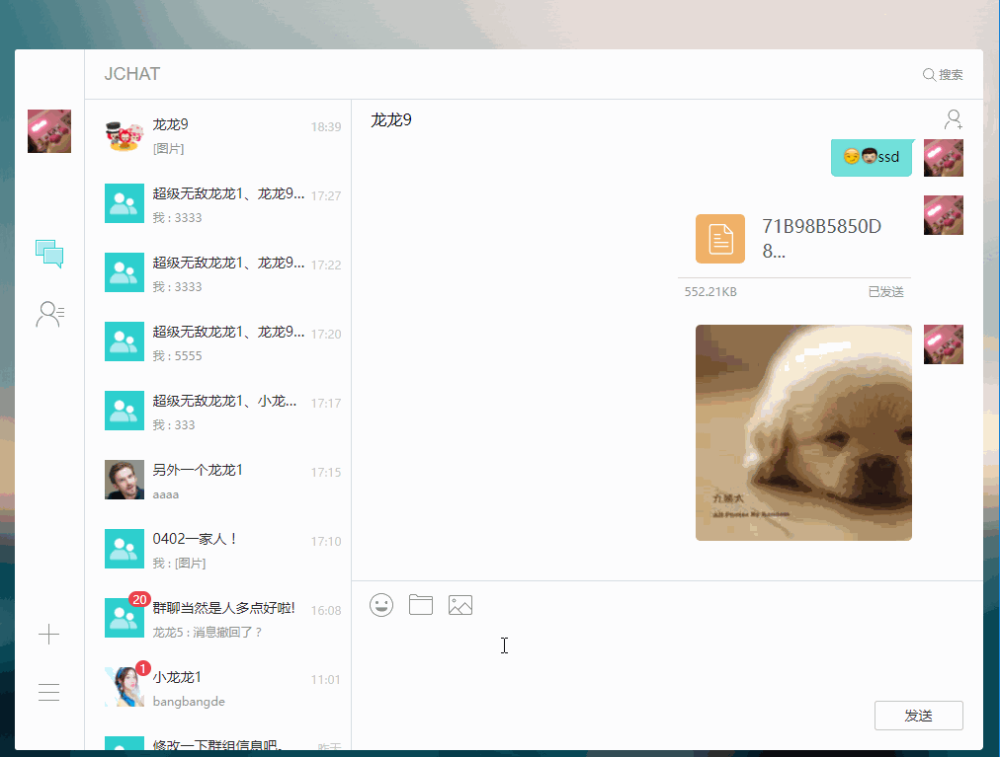
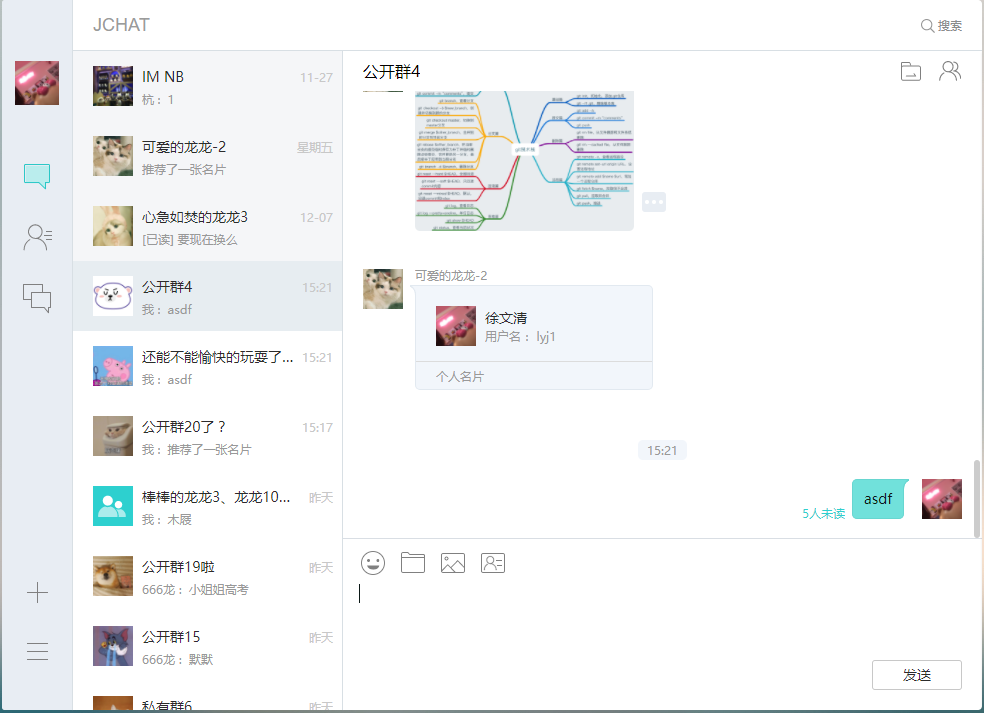

# JChat-web


		
### 简介

JChat 是基于 JMessage SDK 带有完整 UI 界面的即时通讯应用。 演示了完整的即时通讯功能，包括：

* 单聊、群聊、会话列表、通讯录；
* 支持发送文本、图片、文件、表情；
* 提供用户管理、群组管理、黑名单、群屏蔽、消息漫游等功能；

JChat 无需成为好友也可以聊天

* 通过搜索对方的用户名可直接发起会话

目前已覆盖 [Android](https://github.com/jpush/jchat-android) 、 [iOS](https://github.com/jpush/jchat-swift) 和 web 平台，开发者可参照 JChat 快速打造自己的产品，提高开发效率。



### 应用截图



### 在线体验地址

<a href="https://jchat.im.jiguang.cn/#/login" target="_blank">JChat-web在线体验</a>

### 环境配置

前提：安装 node 

web jchat本地安装和用法：

```
npm install(如果安装后仍缺少依赖，则是该模块被墙掉了，推荐使用淘宝镜像cnpm安装依赖，安装方法自行google)
```
```
npm run dll
```
```
npm run dev
```
打开浏览器：
localhost:3000

### 备注说明

* 整个应用使用Angular2 + webpack + gulp的技术栈，使用了Angular2中的ngrx去管理应用状态
* 当前是jchat-web v1.0.0版本，暂无好友、免打扰等功能，相关功能将在v1.1.0实现
* 业务事件消息，如群聊成员入群消息等，目前实现方法较为复杂，在js sdk更新版本后，v1.1.0将重写相关功能
* 浏览器兼容性: IE11+ ， Chrome ， Firefox ， Safari，后续考虑兼容IE10
* 发布时整个项目的静态资源由gulp提交到七牛上，如需使用此功能，需在src/task/config.json中配置ak和sk以及url

### JMessage 文档

* [JMessage web 开发指南](https://docs.jiguang.cn/jmessage/client/im_sdk_js_v2/)